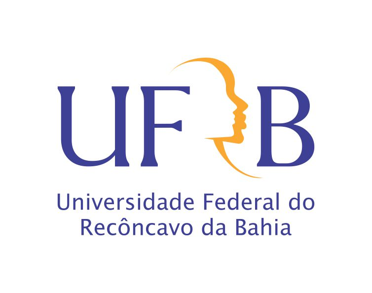

# texto-markdown
Repositório para Lição 04

# Universidade Federal do Recôncavo da Bahia

## Centro de formação de professoreees

### Licenciatura em Matemática

O Lorem Ipsum é um texto modelo da indústria tipográfica e de impressão. O Lorem Ipsum tem vindo a ser o texto padrão usado por estas indústrias desde o ano de 1500, quando uma misturou os caracteres de um texto para criar um espécime de **livro**. E *muito* mais...

```
bloco de código
```
Este texto não só sobreviveu 5 séculos, mas também o salto para a tipografia electrónica, mantendo-se essencialmente inalterada. Foi popularizada nos anos 60 com a disponibilização das folhas de Letraset, que continham passagens com Lorem Ipsum, e mais recentemente com os programas de publicação como o Aldus PageMaker que incluem versões do Lorem Ipsum.

>É um facto estabelecido de que um leitor é distraído pelo conteúdo legível de uma página quando analisa a sua mancha gráfica. Logo, o uso de Lorem Ipsum leva a uma distribuição mais ou menos normal de letras, ao contrário do uso de "Conteúdo aqui, conteúdo aqui", tornando-o texto legível.

[Google](https://www.google.com.br/)



- Casa
- Pneu
- Bloco
- Água
- Terra
 
## Veja a tabela abaixo

|Turma|Qnt de Alunos|
| ------------- |:-------------:|
|A|25|
|B|31|
|C|18|


